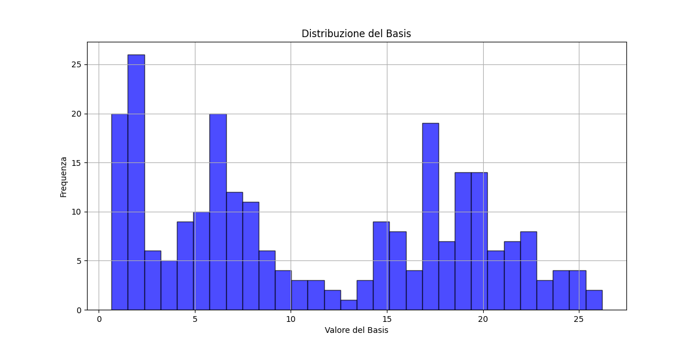
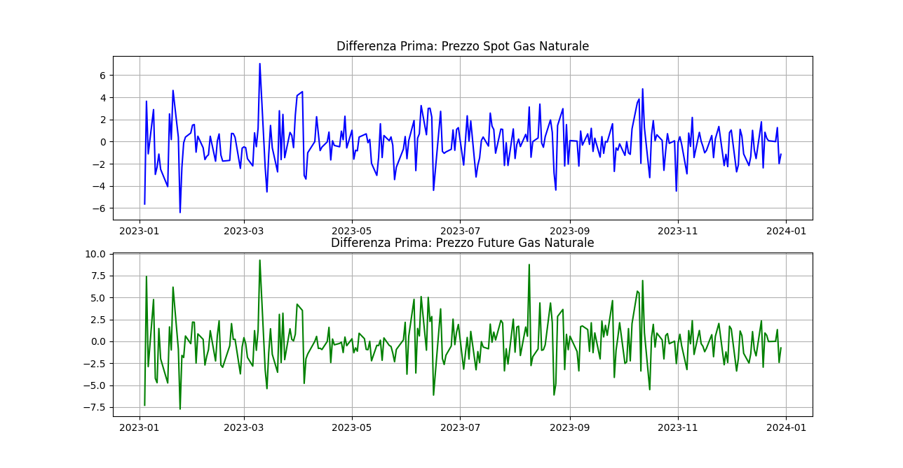
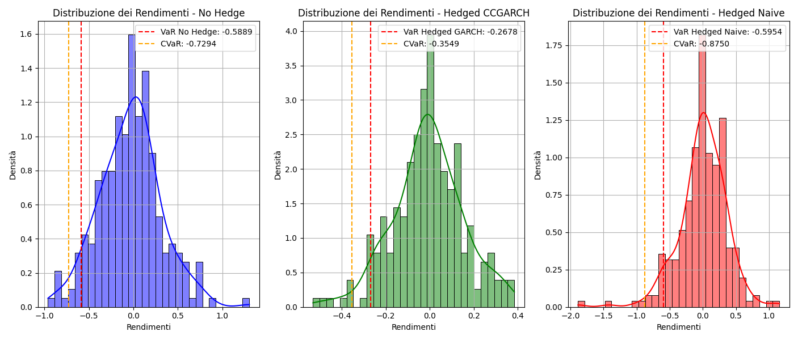

# Proxy Hedging

Nel mondo delle commodity energetiche, capita spesso che non esista un future specifico una particolare commodity. Questo può essere dovuto a diversi fattori, come la scarsa liquidità del mercato o differenze temporali tra i vari strumenti finanziari disponibili rispetto l'esigenza di copertura della commodity. In questi casi, si ricorre a tecniche come il proxy hedging, che consiste nel coprirsi utilizzando futures di commodity correlate. Uno dei primi passi nella metodologia del proxy hedging è lo studio delle correlazioni tra i diversi strumenti finanziari e la loro liquidità, per individuare quelli più adatti a gestire il rischio di prezzo. In questa parte del progetto, ho scelto di approfondire l'analisi della correlazione, tralasciando la componente della liquidità.

## Analisi della Correlazione

L’analisi della correlazione è essenziale per comprendere le connessioni tra le diverse commodity e i relativi contratti futures. Di seguito ho riportato un grafico che illustra la matrice di correlazione tra i prezzi degli strumenti analizzati.

Dalla matrice emerge chiaramente una forte correlazione tra il prezzo del GAS e il TTF. In generale le correlazioni rispecchiano quelle che sono le evidenze in letteratura.


### Matrice di Correlazione

|                | Gas_Spot | Future_TTF | UK_Future | NG_Future | Brent_Future | WTI_Future | Heating_Oil | Gasoline |
|----------------|----------|------------|-----------|-----------|--------------|------------|-------------|----------|
| **Gas_Spot**      | 1.000000 |            |           |           |              |            |             |          |
| **Future_TTF**    | 0.669480 | 1.000000   |           |           |              |            |             |          |
| **UK_Future**     | 0.251176 | 0.456784   | 1.000000  |           |              |            |             |          |
| **NG_Future**     | 0.311908 | 0.553174   | 0.919424  | 1.000000  |              |            |             |          |
| **Brent_Future**  | 0.248799 | 0.283622   | 0.515228  | 0.354178  | 1.000000     |            |             |          |
| **WTI_Future**    | 0.205299 | 0.182846   | 0.531196  | 0.342093  | 0.982599     | 1.000000   |             |          |
| **Heating_Oil**   | 0.332338 | 0.449748   | 0.603096  | 0.561489  | 0.851139     | 0.809809   | 1.000000    |          |
| **Gasoline**      | 0.329363 | -0.292603  | -0.297367 | -0.336401 | 0.209285     | 0.224240   | 0.131426    | 1.000000 |


## Analisi del Rischio Base

Una volta identificato l'asset più appropriato e il contratto future da utilizzare per coprirsi dal rischio di prezzo della commodity, si procede all'analisi del rischio base. Il **basis risk** rappresenta il rischio che i prezzi forward e spot non si muovano all’unisono nel tempo, causando discrepanze nella copertura (Geman, 2005). Di seguito il grafico della base.

Un valore della base vicino a zero indica un rischio base ridotto, ovvero una ridotta differenza tra il prezzo spot della commodity e il prezzo del future scelto come proxy per la copertura. Durante questa fase, oltre al livello della base, esamino anche la volatilità della stessa, che rappresenta l'incertezza associata alla differenza tra i due prezzi, e la sua distribuzione nel tempo per comprendere eventuali pattern o variazioni significative. Una base stabile e con bassa volatilità rende la copertura più efficiente perché riduce l'incertezza legata alla differenza tra prezzo spot e future. In altre parole, se il basis è meno volatile, significa che il rapporto tra il prezzo spot e il prezzo future è più prevedibile, e questo migliora la precisione della copertura, rendendola meno soggetta a variazioni impreviste. Così, il proxy hedging è più efficace perché, in condizioni di basis stabile, la quantità di future necessaria per neutralizzare il rischio di prezzo è calcolata con maggiore affidabilità, riducendo il rischio base e migliorando l’accuratezza dell’hedging stesso.

Questo rischio emerge nel momento in cui un *hedger* apre una posizione sul mercato finanziario al tempo $t_0$ e persiste fino alla chiusura della stessa, ossia in un momento $t'$ tale che $t_0 \leq t' < T$, dove $T$ indica la maturità del contratto derivato. Durante l’intervallo in cui la posizione rimane aperta, è possibile che il prezzo spot e il prezzo forward non seguano perfettamente lo stesso andamento, manifestata in diversi istanti temporali durante la vita residua del future.

Il *basis* può essere rappresentato con la seguente formula:

$$
\text{Basis} = \text{Prezzo Spot} - \text{Prezzo Forward}
$$

Questo scarto nel prezzo contribuisce al *basis risk*, influenzando l’efficacia della copertura se la volatilità della base risulta elevata.

Una misura comune del basis risk si ottiene calcolando la varianza della base. Indicando con $B_{t_0,T}, B_{t_0+1,T}, \ldots, B_{t',T}$ i valori della base ai vari istanti temporali, il basis risk è dato dalla formula:

$
\text{BRT} = \text{Var}(B_{t_0,T}, B_{t_0+1,T}, \ldots, B_{t',T}) = \sigma_S^2 + \sigma_F^2 - 2 \rho \sigma_S \sigma_F
$


| **Parametro**                | **Valore**   |
|------------------------------|--------------|
| Volatilità Spot              | 0.0347       |
| Volatilità Future            | 0.0628       |
| Volatilità del Basis         | 7.62         |

Come vediamo, la volatilità dello spot è circa $1/2$ di quella del future. La volatilità della base è piuttosto elevata, suggerendo una notevole incertezza nella differenza tra i due prezzi. Probabilmente questa dinamica può essere compresa meglio analizzando il seguente grafico della base. 


Inoltre, la distribuzione della base nel tempo, come da grafico sottostante, presenta una forma bimodale ma una tendenza delle basi vicino lo zero.



**Alla luce di questi risultati dovremmo provare ad analizzare ulteriori combinazioni tra asset**

## Ciclo di Mercato: Contango e Backwardation

Successivamente, ho esaminato le condizioni di mercato per capire se ci troviamo in una fase di contango o backwardation. Queste due situazioni descrivono le dinamiche tra il mercato spot e quello dei futures e influenzano in modo rilevante le strategie di copertura e la gestione del rischio. E' fondamentale per ogni partecipante al mercato essere consapevole della struttura attuale dei prezzi. Il mercato si trova in contango quando i prezzi dei futures sono superiori ai prezzi spot, mentre si trova in backwardation quando i prezzi dei futures sono inferiori ai prezzi spot (Schofield, 2007). Ad esempio, il petrolio greggio tende ad essere più soggetto a backwardation. Questo avviene perché il petrolio è relativamente costoso da immagazzinare, il che disincentiva la conservazione. Quando c'è un aumento della domanda, le scorte attuali potrebbero non essere sufficienti a soddisfarla. Ciò crea un intervallo di tempo tra i prezzi spot e quelli dei futures, facendo salire i prezzi spot rispetto a quelli dei futures e portando il mercato in backwardation. 

Tipicamente, i mercati in **backwardation** sono caratterizzati da una scarsità della commodity, scorte basse, prezzi volatili a causa delle scorte limitate e un aumento dei prezzi. Al contrario, i mercati in **contango** si caratterizzano per un'abbondanza della commodity e per scorte elevate. In queste condizioni, i prezzi spot tendono a essere inferiori rispetto ai prezzi dei futures, poiché i partecipanti al mercato anticipano che le scorte attuali potranno soddisfare la domanda futura. Questa situazione può verificarsi, ad esempio, in periodi di stabilità nella produzione e di bassa volatilità dei prezzi. In un mercato in contango, gli investitori possono essere incentivati a comprare e immagazzinare la commodity, aspettandosi di rivenderla a un prezzo più elevato in futuro.

- **Impatto sul Trading**: In un mercato in contango, gli investitori che desiderano mantenere una posizione a lungo termine affrontano costi maggiori al momento della scadenza dei contratti futures. Questo è dovuto al processo di *rollover*, che implica la chiusura di una posizione in un contratto in scadenza e l'apertura di un nuovo contratto con scadenza futura. Poiché il nuovo contratto è a un prezzo più elevato, ciò può comportare perdite aggiuntive.

- **Impatto sul Trading**: In un mercato in backwardation, mantenere una posizione di copertura risulta più conveniente, poiché i contratti futures costano meno rispetto al prezzo spot. In questo contesto, i trader possono realizzare guadagni al momento della scadenza dei contratti.

Nel nostro campione, la totalità dei giorni (250) nel campione mostrano una condizione di **backwardation**. Questo **può rendere più conveniente** il mantenimento della posizione di copertura nel tempo. 

### Conclusioni analisi preliminari
L'analisi della correlazione ha rivelato una discreta interconnessione tra i diversi strumenti finanziari nel contesto delle commodity. Allo stesso tempo, l'analisi delle condizioni di mercato ha evidenziato una preferenza nell'utilizzo di questo strumento, grazie alla sua capacità di adattarsi alle fluttuazioni dei prezzi. Pertanto, nonostante l'elevata volatilità del basis, questa viene considerata secondaria rispetto ai vantaggi potenziali derivanti dall'adozione di strategie di copertura basate su tali strumenti. In questo contesto, la combinazione di una correlazione soddisfacente e delle condizioni di mercato favorevoli può rendere l'approccio del proxy hedging particolarmente interessante. Rimaniamo in attesa dell'analisi sulla liquidità, che potrà fornire ulteriori spunti per valutare l'efficacia di queste strategie.

## Stima Hedge Ratio
Un aspetto fondamentale, una volta scelto lo strumento finanziario, è la stima della quantità ottima di futures da acquistare per ridurre il rischio di portafoglio. Questo può essere realizzato attraverso l'utilizzo di diversi modelli. In questo lavoro, presenterò tre approcci principali: OLS, CC-GARCH e DCC-GARCH. Questi modelli offrono diverse prospettive e metodi per ottimizzare la copertura e minimizzare il rischio associato all'oscillazione dei prezzi delle commodity.

## Analisi OLS (Ordinary Least Squares)

In questo contesto, utilizziamo il modello OLS per analizzare la relazione tra i prezzi spot e i prezzi futures delle commodity. In particolare, l'equazione OLS si presenta come una semplice relazione del tipo $Y = X + \epsilon$, dove $Y$ rappresenta i prezzi spot, $X$ i prezzi futures, e $\epsilon$ è l'errore. I risultati di questa analisi sono riportati di seguito:

### OLS Regression Results

| **Dep. Variable:**   **Gas_Spot**      | **R-squared:**         | 0.448   |
|---------------------------------------|---------------------|----------|
| **Model:**           OLS              | **Adj. R-squared:**   | 0.446   |


| **Coefficients**              | **coef**  | **std err** | **t**    | **P>t** | **[0.025** | **0.975]** |
|-------------------------------|-----------|-------------|----------|-----------|-------------|-------------|
| const                         | 32.8455   | 1.434       | 22.905   | 0.000     | 30.021      | 35.670      |
| Future                        | 0.4786    | 0.034       | 14.193   | 0.000     | 0.412       | 0.545       |

**Notes:**  
[1] Standard Errors assume that the covariance matrix of the errors is correctly specified.
**Aggiustati per Standard Error:** nessun miglioramento


### Residui OLS
Per garantire la correttezza dei risultati, è fondamentale effettuare test sui residui e, se necessario, adottare misure correttive, come la trasformazione dei dati o l'utilizzo di modelli più complessi, come il GARCH, per catturare la dinamica della volatilità.

In questo caso, i residui non seguono una distribuzione normale e il test di Breusch-Pagan fornisce una chiara evidenza della presenza di eteroschedasticità. L'eteroschedasticità si riferisce a una situazione in cui gli errori non sono distribuiti uniformemente. Questo comporta che la varianza degli errori non rimane costante e può influenzare l'affidabilità delle stime e dei test statistici, rendendo la stima biased e la consecutiva necessità di un approccio alternativo.

### Test eteroschedasticità

| **LM Stat** | **LM p-value** | **F-stat** | **F p-value** |
|-------------|----------------|------------|---------------|
| 5.0065      | 0.0253         | 5.0679     | 0.0252        |

**Conclusione**:  
Il P-value di 0.0253 è inferiore a 0.05, quindi si rifiuta l'ipotesi nulla.  
C'è **eteroschedasticità**.

### Trasformazione dati in log
Ho effettuato la trasformazione dei dati in logaritmi e ho rieseguito la regressione, ma non ho riscontrato alcun miglioramento nei risultati. Di seguito presento i risultati ottenuti.

### test eteroschedasticità

| **LM Stat** | **LM p-value** | **F-stat** | **F p-value** |
|-------------|----------------|------------|---------------|
| 5.9757      | 0.0145         | 6.0730     | 0.0144        |

**Conclusione**:  
Il P-value di 0.0145 è inferiore a 0.05, quindi si rifiuta l'ipotesi nulla.  
C'è **eteroschedasticità**.


## Analisi della Stazionarietà

Dato che i modelli OLS non possono essere usati per la presenza di bias, devo utilizare un modello alternativo tra quelli presenti in letteratura. Il GARCH è sicuramente una scelta valida ma per usare questa classe di modelli dobbiamo testare la presenza di stazionarietà nei dati. La stazionarietà è una condizione in cui le proprietà statistiche di una serie temporale, come la media e la varianza, rimangono costanti nel tempo. Nello specifico, le serie temporali sono raramente stazionarie, ma la loro differenza prima $diff = P_t - P_{t-1}$
 è spesso stazionaria, come osservato nel grafico seguente.



### Test ADF (Augmented Dickey-Fuller)

Il test ADF è uno strumento utilizzato per verificare la presenza di una radice unitaria in una serie temporale. I risultati del test forniscono informazioni sulla stazionarietà della serie:

- **Ipotesi nulla**: La serie ha una radice unitaria (non è stazionaria).
- **Ipotesi alternativa**: La serie non ha una radice unitaria (è stazionaria).

Se il valore del p-value è inferiore a 0.05, si rifiuta l'ipotesi nulla, indicando che la serie è stazionaria e suggerendo l'uso dei prezzi in log. In caso contrario, non si può rifiutare l'ipotesi nulla, e la serie è considerata non stazionaria.

### Risultati del Test di Dickey-Fuller Aumentato

| **Serie**                               | **ADF Test Statistic** | **p-value**         | **Lags Used** | **Observations Used** | **Conclusione**                        |
|-----------------------------------------|------------------------|---------------------|---------------|-----------------------|----------------------------------------|
| Differenza Prima Log Prezzo Spot Gas     | -16.1787               | 4.2893e-29          | 0             | 248                   | Serie stazionaria (ipotesi nulla rifiutata), si suggerisce di usare i prezzi in log |
| Differenza Prima Log Prezzo Future Gas   | -8.2667                | 4.9151e-13          | 3             | 245                   | Serie stazionaria (ipotesi nulla rifiutata), si suggerisce di usare i prezzi in log |


## Modello CC-GARCH (Constant Correlation GARCH)

### Introduzione
Il modello CCGARCH (Constant Correlation Generalized Autoregressive Conditional Heteroskedasticity) è una generalizzazione dei modelli GARCH tradizionali, progettato per analizzare le relazioni di volatilità tra più serie temporali. Questo modello è particolarmente utile nel contesto della gestione del rischio e della copertura in mercati finanziari come quelli delle materie prime, dove la volatilità dei prezzi può influenzare significativamente profitti e perdite.

### Funzionalità e Applicazione
Il CCGARCH assume che la correlazione tra le serie dei Returns (in questo caso, i rendimenti del gas naturale spot e del future) rimanga **costante nel tempo**. Attraverso il modello, possiamo calcolare l'OHR come il rapporto tra la covarianza condizionale e la varianza condizionale dei rendimenti, fornendo così un'indicazione della quantità di future da acquistare o vendere per coprire il rischio associato a una posizione spot.

**formalmente abbiamo:**

$$OHR = correlation \times \frac{h_{spot}}{h_{future}}$$

Dove:

- $$h_{\text{future}}$$ rappresenta la volatilità condizionale del future,
- $$h_{\text{spot}}$$ rappresenta la volatilità condizionale dello spot,
- $$\text{correlation}$$ è la correlazione tra i rendimenti spot e future,
- $$\text{OHR}$$ è il rapporto di copertura ottimale (Optimal Hedge Ratio).


### Codice per il Modello CCGARCH
Di seguito è riportato il codice per implementare il modello CCGARCH e calcolare l'Optimal Hedge Ratio (OHR):

```python
# Calcolo dei rendimenti logaritmici
def calcola_rendimenti(spot, future):
    dati = variabili()
    dati['Return_Spot'] = np.log(dati[spot].pct_change() + 1)
    dati['Return_Future'] = np.log(dati[future].pct_change() + 1)
    #i rendimenti sono molto piccoli quindi andrebbero riscalati:
    dati['Return_Spot'] = 10 * np.log(dati[spot].pct_change() + 1)
    dati['Return_Future'] = 10 * np.log(dati[future].pct_change() + 1)

    rendimenti = dati.dropna()
    print(f"Questi sono i rendimenti:\n{rendimenti}")
    return rendimenti


def ccgarch_hedge_ratio(spot, future):
    dati = calcola_rendimenti(spot, future) 

    # Modello GARCH(1,1) sui rendimenti dello spot
    model_spot = arch_model(dati['Return_Spot'].dropna(), vol='Garch', p=1, q=1, dist='t') #ho scelto la distribuzione t percheé fitta meglio
    res_spot = model_spot.fit(disp='off') 
    # Modello GARCH(1,1) sui rendimenti del future
    model_future = arch_model(dati['Return_Future'].dropna(), vol='Garch', p=1, q=1, dist='t') #ho scelto la distribuzione t percheé fitta meglio
    res_future = model_future.fit(disp='off')

    # Ottengo le varianze condizionali
    h_future = res_future.conditional_volatility
    h_spot = res_spot.conditional_volatility
    correlation = dati['Return_Spot'].corr(dati['Return_Future'])  
    OHR = correlation * (h_spot / h_future)

```
### Utilizzando modelli GARCH la stima dell'OHR è calcolata come nella formula seguente:

$$
\text{OHR} = \text{correlation} \times \left( \frac{h_{\text{spot}}}{h_{\text{future}}} \right)
$$

dove la correlazione è considerata **costante**:

$$
\rho = (Return\_{Spot}, Return\_{Future})
$$

Di seguito riporto il grafico della volatilità condizionata e dell'OHR dinamico.


## Effetti Hedging 

### Effetti sulla varianza

**Uno degli elementi di rischio sui mercati è la volatilità. Pertanto vogliamo capire se l'utilizzo di questi hedge ratio siano in grado di ridurla.**

La varianza senza copertura è calcolata come segue:

$$
\sigma^{2}_{\text{no hedge}} = \text{Var}(Return\_{Spot})
$$

Per calcolare i rendimenti coperti con il modello GARCH, si sottrae la quota (\(OHR\)) dei rendimenti futuri dai rendimenti dello spot:

$$Return\_{coperti}^{ccgarch} = Return\_{Spot} - (OHR \times Return\_{Future})$$

La varianza della copertura con il modello GARCH è calcolata come:

$$
\sigma^{2}{hedge}^{ccgarch} = \text{Var}(Return\_{coperti}^{ccgarch})
$$


Una delle metodologie utilizzate per valutare l'efficacia della copertura è il "minimum variance", che si riferisce alla riduzione della varianza rispetto alla posizione non coperta. Questo approccio calcola la differenza percentuale tra la varianza dei rendimenti spot e la varianza della copertura.

$$
\text{riduzione della varianza} = \frac{\text{varianza no hedge} - \text{varianza hedge CCGARCH}}{\text{varianza no hedge}} \times 100
$$

### Naive

Considero anche la metodologia Naïve, che consiste nel prendere la stessa quantità dello spot per andare short nel future. Questa strategia, pur essendo semplice, spesso porta a risultati inferiori rispetto alla copertura ottenuta tramite il modello CC-GARCH. Nei risultati che presenterò, sarà evidente come la metodologia Naïve non riesca a ridurre il rischio in modo altrettanto efficace rispetto alla strategia di copertura più sofisticata.

### VaR

Nel contesto del mio progetto, la valutazione dell'efficacia della copertura non si basa solo sulla riduzione della volatilità, ma anche sulla diminuzione del Value at Risk (VaR). Il VaR è una misura statistica che quantifica il potenziale di perdita di un investimento in un dato intervallo di tempo con un certo livello di confidenza. Pertanto, un'analisi approfondita del VaR consente di comprendere meglio i rischi associati e l'impatto della copertura sul profilo di rischio complessivo.
Si osserva una riduzione del VaR per il portafoglio coperto con hedge ratio stimato tramite CC-GARCH e un aumento del rischio per il metodo Naive (1:1). Di seguito il grafico con i risultati.



In generale i risultati sono presentati nella tabella sottostante.

### Di seguito i risultati 

| **Metriche**                                          | **Valore**    |
|------------------------------------------------------|---------------|
| Varianza NO hedge                                    | 0.12%         |
| Varianza hedge CCGARCH                               | 0.03%         |
| Riduzione della varianza con CCGARCH                 | 78.46%        |
| Riduzione della varianza (Naïve)                    | -9.18%        |
| Differenza nella riduzione della varianza (CCGARCH - Naïve) | 87.65%  |
| Value at Risk (No Hedge)                             | -0.5889       |
| Value at Risk (Hedged GARCH)                         | -0.2678       |
| Value at Risk (Hedged Naive)                         | -0.5954       |

